1. **Environnement d'exécution des tests** :

   - Outils de test : Cypress v12
   - navigateur : chrome
   - application : Open Cruise :  [OpenCruise (sogeti-center.cloud)](https://opencruise-ok.sogeti-center.cloud/login)
   - OS : Windows 10
   - IDE : VS code
   - Invite de commande : Terminal cmd
   - PC : Pc portable
   - Variables d'environnement :  env url ok  et url ko , données admin (password et login)
2. **jeux de données et autres variables :**

   - données valides pour un particulier : données dans un fichier json de référence (part.json) et qui va être généré à chaque exécution ( en particulier le username) et stocké dans un autre fichier json automatiquement (partAdmin.json)
     pour éviter le message du compte existant.
   - données valides pour un professionnel : données dans un fichier json de base ( pro.json) ) et qui va être réutilisé à chaque exécution pour éviter le message précisé précédemment, et va être stocké dans un autre fichier json (proAdmin.json).
3. **EXECUTION :**

   - Exécutions via des lignes de commande  : sans ou en interaction avec le navigateur
   - - Si Exécuter plusieurs tests qui situant dans plusieurs fichiers dont l'extension est ".cy.js" :

       - ***npx cypress run***
     - Exécuter les tests contenant dans un fichier ou spec cible "test_opencruise.cy.js"  :

       - ***npx cypress run --spec cypress\e2e\ ...\ test_opencruise.cy.js***
     - Générer un rapport -*Create HTML report dans .\cypress\reports\index.html*

       - ***npx cypress run --reporter cypress-mochawesome-reporter***
     - Exécuter le scénario de test en arrière plan tout en en ouvrant le navigateur montrant les exécutions

       par la commande suivante :  ***npx cypress run --headed***
     - Exécuter le test selon un environnement env déterminé

       - sur un environnement ok  (api : ok)  :   *npm run testok*  testok      où testok fait référence au test sur l'env ok
       - sur env ko : *npm run testko    où  testko  fait référence au test sur l'env ko*

     ===============================================================================

   (Run Finished)

   Spec                                              Tests  Passing  Failing  Pending  Skipped
   ┌────────────────────────────────────────────────────────────────────────────────────────────────┐
   │ √  test_opencruise.cy.js                    02:37       6        6        -        -        - │
   └────────────────────────────────────────────────────────────────────────────────────────────────┘
   √  All specs passed!                        02:37        6        6        -        -        -

* Exécution via le navigateur / VS Code :
  voir visuellement en quelque sorte ce qui se passe pendant l'exécution sur le navigateur
  Tous les spec  sont passed et la durée totale d'exécution est : 2m38s

4. **Résultat / Rapport :   Journal d'exécution**

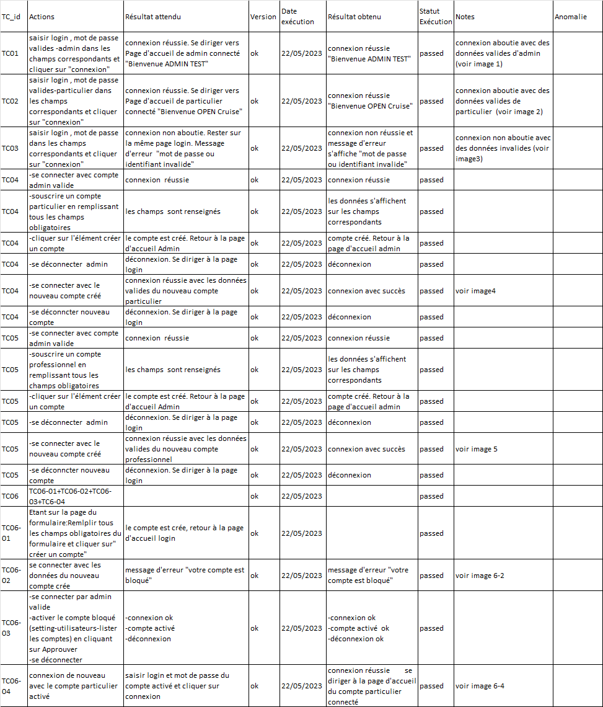

image1 :

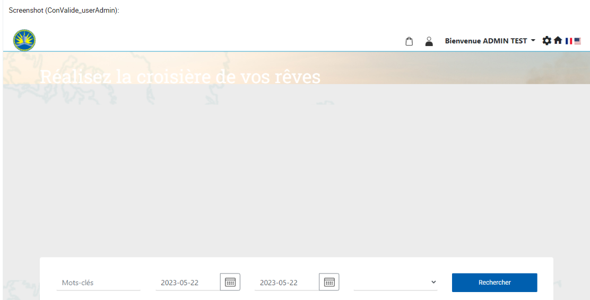

image2:

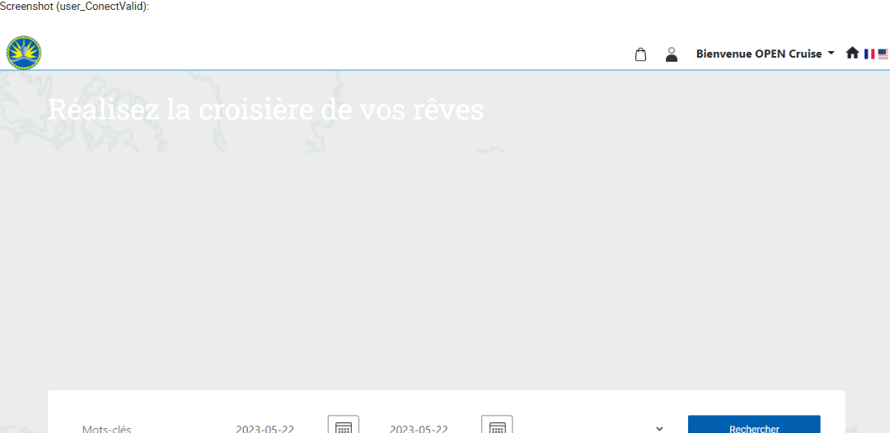

image3 :

image 4 :

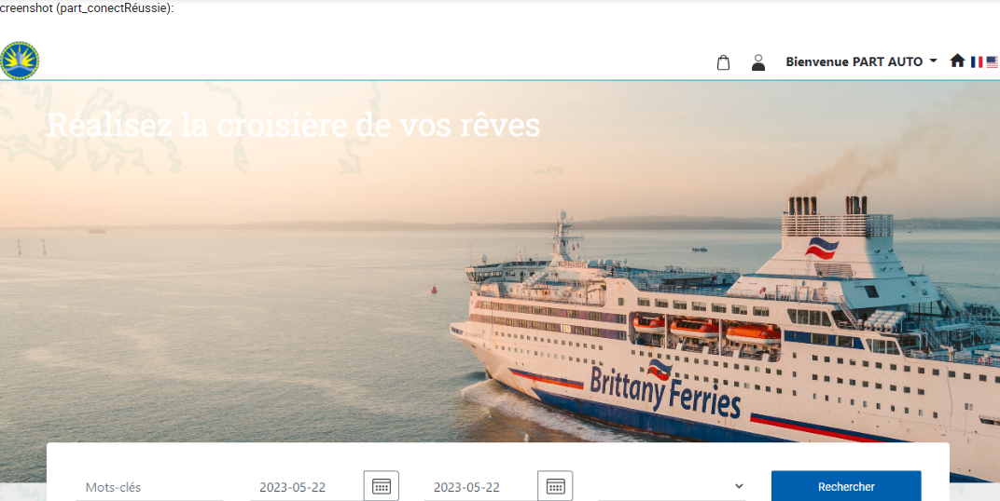

image 5:

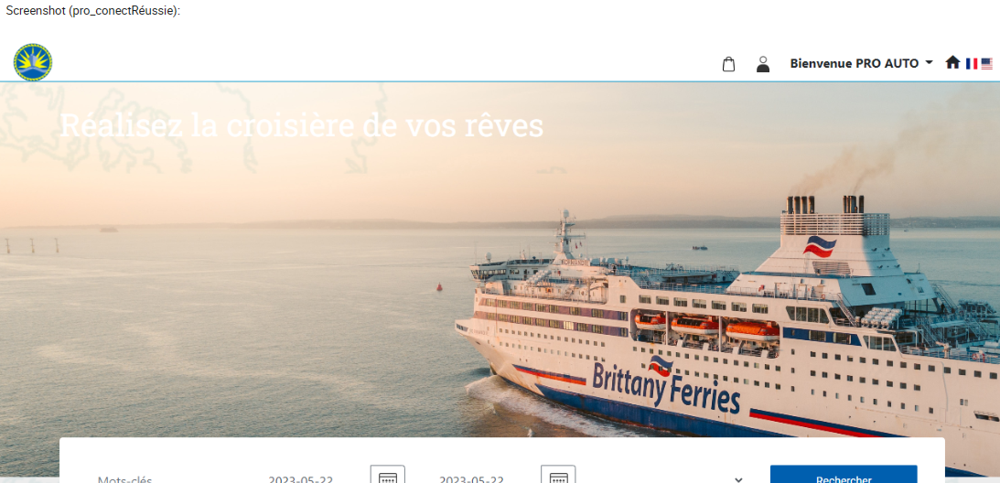

image 6-2:

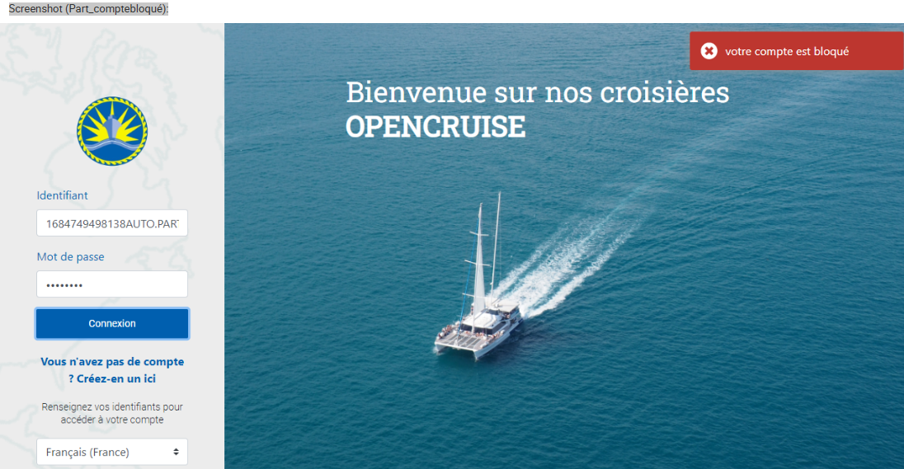

image 6-4:

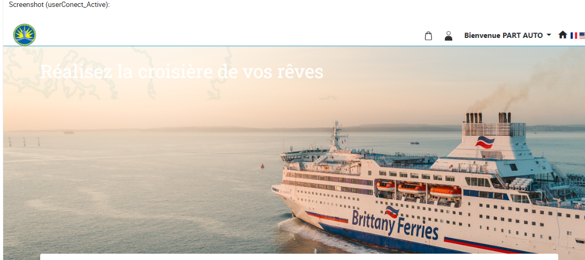

* Suite Journal d'exécution : (23/05/2023)  :

  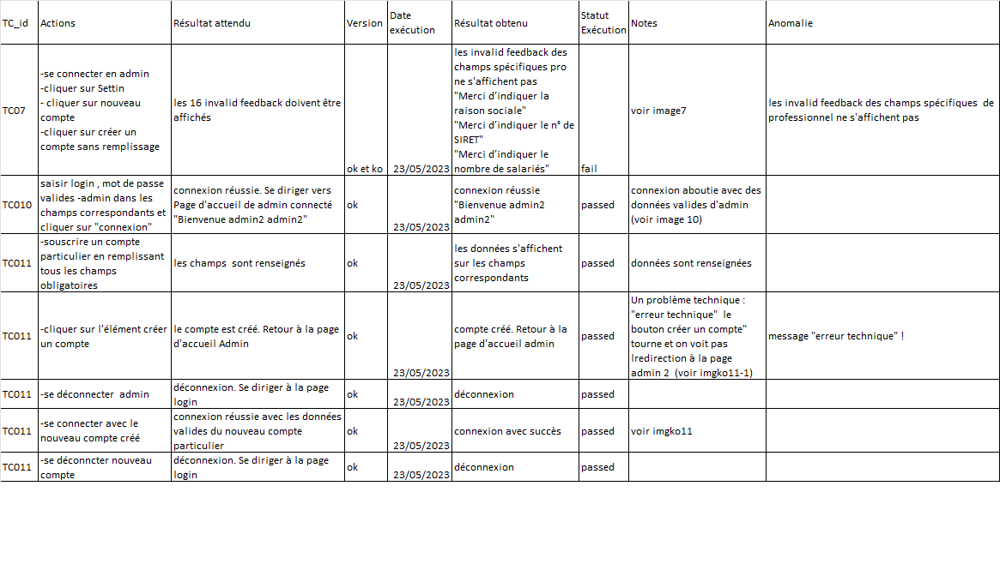

- image7:

  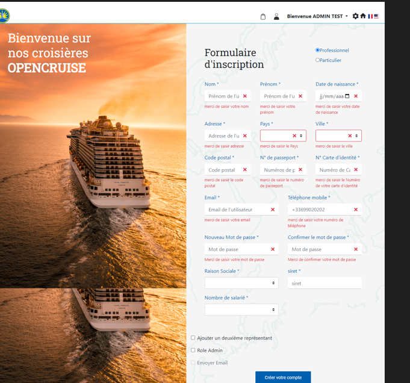
- imgko10 :

  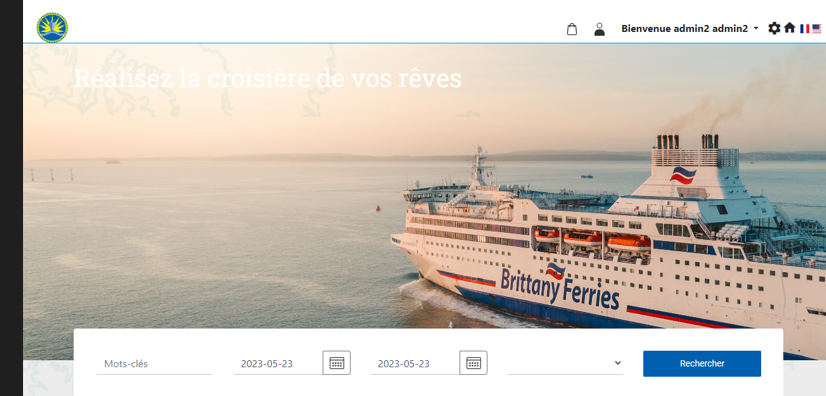
- imgko11-1:

  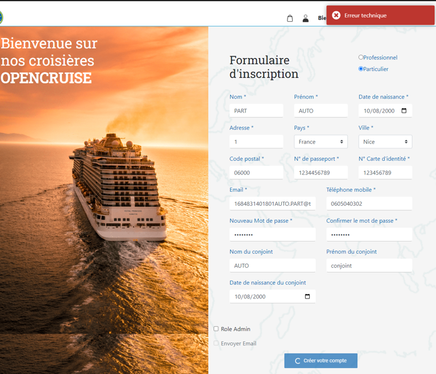
- imgko11:

  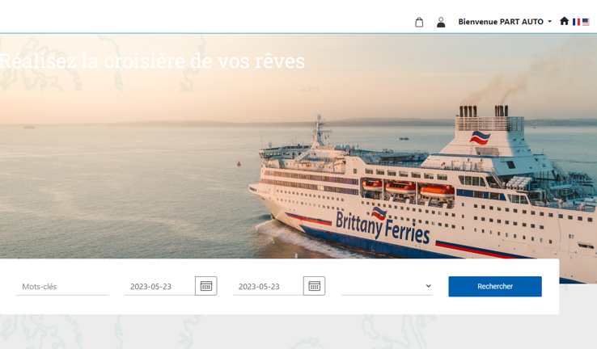
